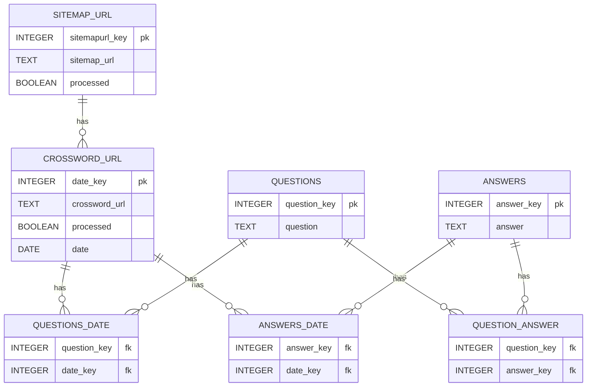

Create the database and build the tables and relations


Table:  crossword_url 

| pk | url_stub (str) | processed (bool) |date (date)
|---|----------------|------------------|---|
|1|nyt-crossword-answers-01-07-11/|FALSE|2011-01-07|


Go through each URL in the URL table and call the page
Find the question/answer table:

```html
<div class="nywrap">
  <ul>
    <li>
      <a href="...">{INNER VALUE IS THE QUESTION}></a>
      <span>{THIS IS THE ANSWER}</span>
    </li>
  </ul>
</div>
```

There are two unordered lists - One for the horizontal clues/answer and one for the vertical.

There is an h3/span that precedes each \<UL> with the value "nydir ve" and "nydir hz" 

For each question/answer, log these in the various questions and answers table

Table:  questions

| pk | question (str, index)               |
| ---|-------------------------------------|
|1| "THEIR SCORES MAY BE ON TRANSCRIPTS" |

Table:  answers

| pk | answer (str, index) |
| ---|---------------------|
|1| "SATS"              |

Table:  questions-date


| question_key | date_key |
|--------------|----------|
| 1            | 1        |


Table:  answers-date

| answer_key | date_key |
|------------|----------|
| 1          | 1        |


Table:  question-answer

| question_key | answer_key |
|--------------|------------|
| 1            | 1          |


Once complete for the URL, mark this url as processed.





```pseudocode
Go to the sitemap page and get all of the sub-sitemaps that are tagged post-sitemap{\d}.xml

For each sitemap in post-sitemaps:

  Go to the sitemap page

  For each inner link with the pattern nyt-crossword-answers-/d/d-/d/d-/d/d:

    Log the link with processed:false and the stub

From the URL database, get the first row where processed is false

  
```
